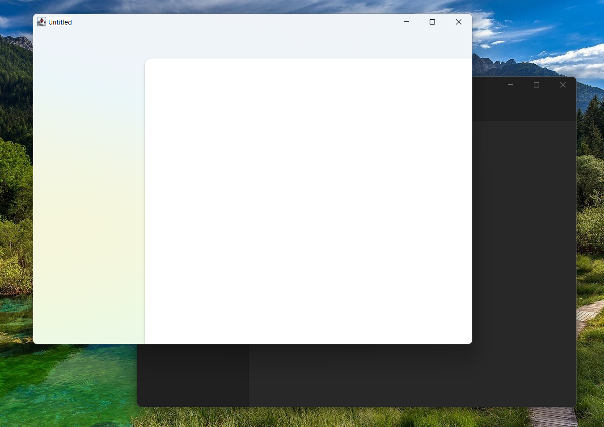

# Compose Window Styler

**Compose Window Styler is a library that lets you style your Compose for Desktop window to have more native and modern UI.**

---



---

## Setup (Gradle)

Kotlin DSL:

```kotlin
repositories {
    mavenCentral()
}

dependencies {
    implementation("com.mayakapps.compose:window-styler:<version>")
}
```

Groovy DSL:

```gradle
repositories {
    mavenCentral()
}

dependencies {
    implementation "com.mayakapps.compose:window-styler:<version>"
}
```

Don't forget to replace `<version>` with the latest/desired version found on Maven Central or here in the releases section.

## Usage

You can apply the desired to your window by using `WindowStyle` inside the `FrameWindowScope` of `Window` composable call. It can be placed anywhere inside it.

Sample Code:

```kotlin
Window(onCloseRequest = ::exitApplication)
    WindowStyle(isDarkTheme = isSystemInDarkTheme(), backdropType = WindowBackdrop.Mica)
    App()
}
```

## Available Styles

### `isDarkTheme`

This property should match the theming system used in your application. It's effect depends on the used backdrop as follows:
* If the `backdropType` is `WindowBackdrop.Mica` or `WindowBackdrop.Tabbed`, it is used to manage the color of the background whether it is light or dark.
* Otherwise, it is used to control the color of the title bar of the window white/black.

### `backdropType`

* `WindowBackdrop.Default`: Though its name may imply that the window will be left unchanged, this is not the case as once the transparency is hacked into the window, it can't be reverted. So, This effect provides a simple solid backdrop colored as white or black according to `isDarkTheme`. This allows the backdrop to blend with the title bar as well.
* `WindowBackdrop.Solid(val color: Color)`: This applies the color as a solid background which means that any alpha component is ignored and the color is rendered as opaque.
* `WindowBackdrop.Transparent(val color: Color)`: Same as `Solid` but allows transparency taking into account the alpha value. If the backdrop is rendered opaque double check that `color` has resonable alpha value.
* `WindowBackdrop.Aero`: This applies [Aero](https://en.wikipedia.org/wiki/Windows_Aero) backdrop which is Windows Vista and Windows 7 version of blur. This effect doesn't allow any customization.
* `WindowBackdrop.Acrylic(val color: Color)`: This applies [Acrylic](https://docs.microsoft.com/en-us/windows/apps/design/style/acrylic) backdrop blended with the supplied color. If the backdrop is rendered opaque double check that `color` has resonable alpha value. Supported on Windows 10 version 1803 or greater.
* `WindowBackdrop.Mica`: This applies [Mica](https://docs.microsoft.com/en-us/windows/apps/design/style/mica) backdrop themed according to `isDarkTheme` value. Supported on Windows 11 21H2 or greater.
* `WindowBackdrop.Tabbed`: This applies Tabbed backdrop themed according to `isDarkTheme` value. This is a backdrop that is similar to `Mica` but targeted at tabbed windows. Supported on Windows 11 22H2 or greater.

#### Fallback Strategy
In case of unsupported effect the library tries to fall back to the nearest supported effect as follows (If an effect is not supported, check for the next):

`Tabbed` -> `Mica` -> `Acrylic` -> `Transparent`

Aero is dropped as it is much more transparent than `Tabbed` or `Mica` and not customizable as `Acrylic`. If `Tabbed` or `Mica` falls back to `Acrylic` or `Transparent`, high alpha is used with white or black color according to `isDarkTheme` to emulate these effects.

## License

This library is distributed under the MIT license.

## Contribution

All contributions are welcomed. If you reporting an issue, please use the issue template. If you're planning to contribute to the code, please open an issue first describing what feature you're planning to add or what issue you're planning to fix. This will allow better discussion and coordination of efforts. You can also check any open issues for bugs/features that needs to be fixed/implemented.

## Acknowledgements
* [flutter_acrylic](https://github.com/alexmercerind/flutter_acrylic): This library is heavily based on flutter_acrylic
* [Swing Acrylic](https://github.com/krlvm/SwingAcrylic): as a reference for the Java implementation of required APIs
