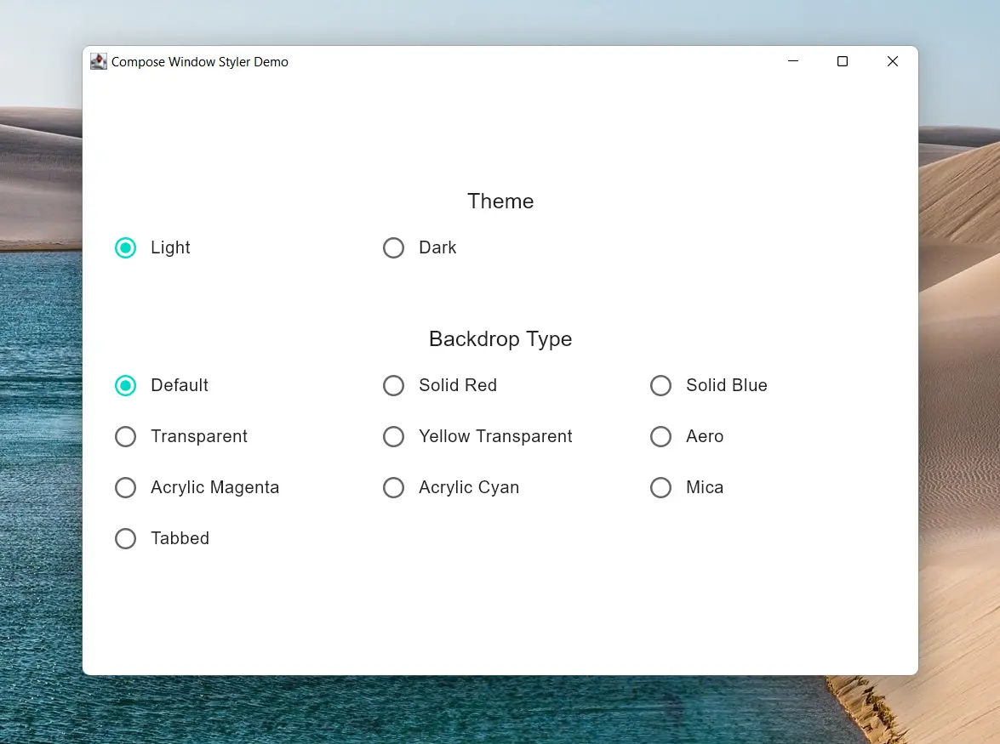

<br />

<div align="center">
    
</div>

<h1 align="center" style="margin-top: 0;">Compose Window Styler</h1>

<div align="center">


[](https://github.com/MayakaApps/ComposeWindowStyler/stargazers)
[](https://github.com/MayakaApps/ComposeWindowStyler/blob/main/LICENSE)


[](https://twitter.com/intent/tweet?text=Compose%20Window%20Styler%20is%20a%20library%20that%20lets%20you%20style%20your%20Compose%20for%20Desktop%20window%20to%20have%20more%20native%20and%20modern%20UI.:&url=https%3A%2F%2Fgithub.com%2FMayakaApps%2FComposeWindowStyler)

</div>

**Compose Window Styler is a library that lets you style your Compose for Desktop window to have more native and modern
UI. This includes styling the window to use acrylic, mica ...etc.**

---



---

## Setup (Gradle)

Kotlin DSL:

```kotlin
repositories {
    mavenCentral()

    // Add only if you're using snapshot version
    maven("https://s01.oss.sonatype.org/content/repositories/snapshots/")
}

dependencies {
    implementation("com.mayakapps.compose:window-styler:<version>")
}
```

Groovy DSL:

```gradle
repositories {
    mavenCentral()
    
    // Add only if you're using snapshot version
    maven { url "https://s01.oss.sonatype.org/content/repositories/snapshots/" }
}

dependencies {
    implementation "com.mayakapps.compose:window-styler:<version>"
}
```

Don't forget to replace `<version>` with the latest/desired version found on the badges above.

## Usage

You can apply the desired to your window by using `WindowStyle` inside the `WindowScope` of `Window` or similar
composable calls. It can be placed anywhere inside them.

Sample Code:

```kotlin
Window(onCloseRequest = ::exitApplication) {
    WindowStyle(
        isDarkTheme = isDarkTheme,
        backdropType = backdropType,
        frameStyle = WindowFrameStyle(cornerPreference = WindowCornerPreference.NOT_ROUNDED),
    )

    App()
}
```


## Documentation

See documentation [here](https://mayakaapps.github.io/ComposeWindowStyler/index.html)

## Available Styles

### `isDarkTheme`

This property should match the theming system used in your application. It's effect depends on the used backdrop as
follows:

* If the `backdropType` is `WindowBackdrop.Mica` or `WindowBackdrop.Tabbed`, it is used to manage the color of the
  background whether it is light or dark.
* Otherwise, it is used to control the color of the title bar of the window white/black.

### `backdropType`

* `WindowBackdrop.Default`: Though its name may imply that the window will be left unchanged, this is not the case as
  once the transparency is hacked into the window, it can't be reverted. So, This effect provides a simple solid
  backdrop colored as white or black according to `isDarkTheme`. This allows the backdrop to blend with the title bar as
  well.
* `WindowBackdrop.Solid(val color: Color)`: This applies the color as a solid background which means that any alpha
  component is ignored and the color is rendered as opaque.
* `WindowBackdrop.Transparent`: This makes the window fully transparent.
* `WindowBackdrop.Transparent(val color: Color)`: Same as `Solid` but allows transparency taking into account the alpha
  value. If the passed color is fully opaque, the alpha is set to `0.5F`.
* `WindowBackdrop.Aero`: This applies [Aero](https://en.wikipedia.org/wiki/Windows_Aero) backdrop which is Windows Vista
  and Windows 7 version of blur. This effect doesn't allow any customization.
* `WindowBackdrop.Acrylic(val color: Color)`: This
  applies [Acrylic](https://docs.microsoft.com/en-us/windows/apps/design/style/acrylic) backdrop blended with the
  supplied color. If the backdrop is rendered opaque, double check that `color` has a reasonable alpha value. Supported 
  on Windows 10 version 1803 or greater.
* `WindowBackdrop.Mica`: This applies [Mica](https://docs.microsoft.com/en-us/windows/apps/design/style/mica) backdrop
  themed according to `isDarkTheme` value. Supported on Windows 11 21H2 or greater.
* `WindowBackdrop.Tabbed`: This applies Tabbed backdrop themed according to `isDarkTheme` value. This is a backdrop that
  is similar to `Mica` but targeted at tabbed windows. Supported on Windows 11 22H2 or greater.

#### Fallback Strategy

In case of unsupported effect the library tries to fall back to the nearest supported effect as follows (If an effect is
not supported, check for the next):

`Tabbed` -> `Mica` -> `Acrylic` -> `Transparent`

Aero is dropped as it is much more transparent than `Tabbed` or `Mica` and not customizable as `Acrylic`. If `Tabbed`
or `Mica` falls back to `Acrylic` or `Transparent`, high alpha is used with white or black color according
to `isDarkTheme` to emulate these effects.

### `frameStyle`

All the following properties are only supported on Windows 11 or greater and has no effect on other OSes.

* `borderColor`: specifies the color of the window border that is running around the window if the window is decorated.
  This property doesn't support transparency.
* `titleBarColor`: specifies the color of the window title bar (caption bar) if the window is decorated. This property
  doesn't support transparency.
* `captionColor`: specifies the color of the window caption (title) text if the window is decorated. This property
  doesn't support transparency.
* `cornerPreference`: specifies the shape of the corners you want. For example, you can use this property to avoid
  rounded corners in a decorated window or get the corners rounded in an undecorated window.

## License

This library is distributed under Apache 2.0 License. See [LICENSE](LICENSE) for more information.

## Contributing

All contributions are welcome. If you are reporting an issue, please use the provided template. If you're planning to
contribute to the code, please open an issue first describing what feature you're planning to add or what issue you're
planning to fix. This allows better discussion and coordination of efforts. You can also check open issues for
bugs/features that needs to be fixed/implemented.

## Acknowledgements

* [flutter_acrylic](https://github.com/alexmercerind/flutter_acrylic): This library is heavily based on flutter_acrylic
* [Swing Acrylic](https://github.com/krlvm/SwingAcrylic): as a reference for the Java implementation of required APIs
