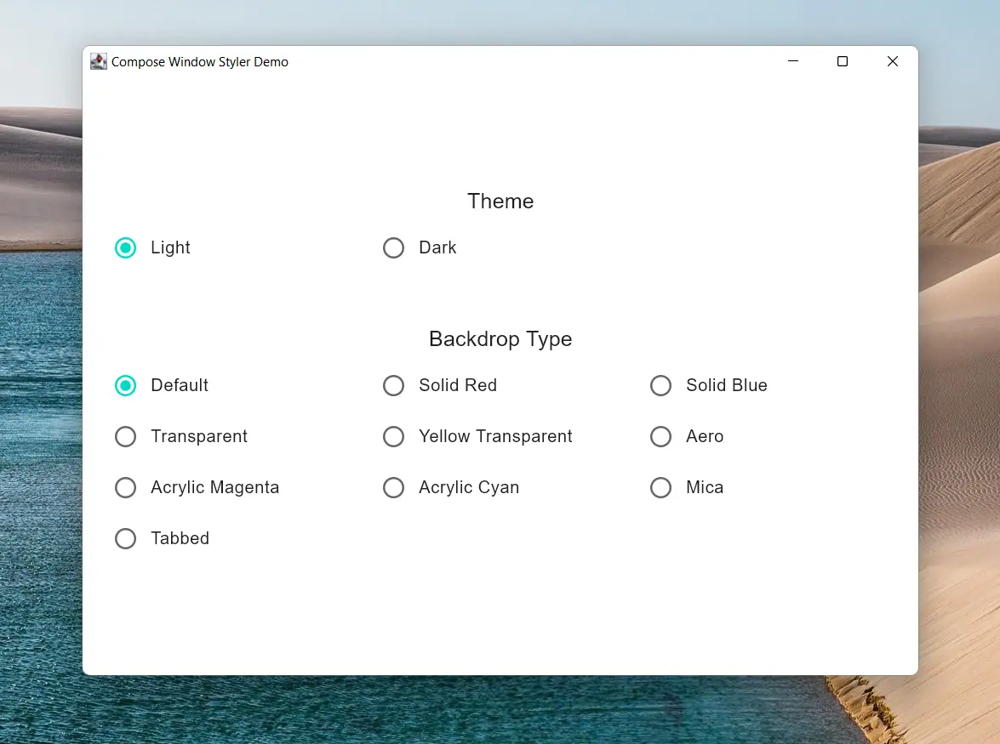

Compose Window Styler is a library that lets you style your Compose for Desktop window to have more
native and modern UI. This includes styling the window to use acrylic, mica, ...etc.

---



---

## Setup (Gradle)

```kotlin
repositories {
    mavenCentral()

    // Add only if you're using snapshot version
    maven("https://s01.oss.sonatype.org/content/repositories/snapshots/")
}

dependencies {
    implementation("com.mayakapps.compose:window-styler:{{ versions.library }}")
}
```

## Usage

You can apply the desired style to your window by using `WindowStyle` inside the `WindowScope` of
`Window` or similar composable calls. It can be placed anywhere inside them.

Sample Code:

```kotlin
Window(onCloseRequest = ::exitApplication) {
    WindowStyle(
        isDarkTheme = isDarkTheme,
        backdropType = backdropType,
        frameStyle = WindowFrameStyle(cornerPreference = WindowCornerPreference.NOT_ROUNDED),
    )

    App()
}
```

## Available Styles

### `isDarkTheme`

This property should match the theming system used in your application. Its effect depends on the
used backdrop as follows:

* If the `backdropType` is `WindowBackdrop.Mica` or `WindowBackdrop.Tabbed`, it is used to manage
  the color of the background whether it is light or dark.
* Otherwise, it is used to control the color of the title bar of the window white/black.

### `backdropType`

* `WindowBackdrop.Default`: Though its name may imply that the window will be left unchanged, this
  is not the case as once the transparency is hacked into the window, it can't be reverted. So, this
  effect provides a simple solid backdrop colored as white or black according to `isDarkTheme`. This
  allows the backdrop to blend with the title bar as well.
* `WindowBackdrop.Solid(val color: Color)`: This applies the color as a solid background which means
  that any alpha component is ignored and the color is rendered as opaque.
* `WindowBackdrop.Transparent`: This makes the window fully transparent.
* `WindowBackdrop.Transparent(val color: Color)`: Same as `Solid` but allows transparency, taking
  into account the alpha value. If the passed color is fully opaque, the alpha is set to `0.5F`.
* `WindowBackdrop.Aero`: This applies [Aero](https://en.wikipedia.org/wiki/Windows_Aero) backdrop
  which is Windows Vista and Windows 7 version of blur. This effect doesn't allow any customization.
* `WindowBackdrop.Acrylic(val color: Color)`: This
  applies [Acrylic](https://docs.microsoft.com/en-us/windows/apps/design/style/acrylic) backdrop
  blended with the supplied color. If the backdrop is rendered opaque, double check that `color` has
  a reasonable alpha value. Supported on Windows 10 version 1803 or greater.
* `WindowBackdrop.Mica`: This
  applies [Mica](https://docs.microsoft.com/en-us/windows/apps/design/style/mica) backdrop themed
  according to `isDarkTheme` value. Supported on Windows 11 21H2 or greater.
* `WindowBackdrop.Tabbed`: This applies Tabbed backdrop themed according to `isDarkTheme` value.
  This is a backdrop that is similar to `Mica` but targeted at tabbed windows. Supported on Windows
  11 22H2 or greater.

#### Fallback Strategy

In case of unsupported effect the library tries to fall back to the nearest supported effect as
follows (If an effect is not supported, check for the next):

`Tabbed` -> `Mica` -> `Acrylic` -> `Transparent`

Aero is dropped as it is much more transparent than `Tabbed` or `Mica` and not customizable as
`Acrylic`. If `Tabbed`
or `Mica` falls back to `Acrylic` or `Transparent`, high alpha is used with white or black color
according to `isDarkTheme` to emulate these effects.

### `frameStyle`

All the following properties are only supported on Windows 11 or greater and has no effect on other
OSes.

* `borderColor`: specifies the color of the window border that is running around the window if the
  window is decorated. This property doesn't support transparency.
* `titleBarColor`: specifies the color of the window title bar (caption bar) if the window is
  decorated. This property doesn't support transparency.
* `captionColor`: specifies the color of the window caption (title) text if the window is decorated.
  This property doesn't support transparency.
* `cornerPreference`: specifies the shape of the corners you want. For example, you can use this
  property to avoid rounded corners in a decorated window or get the corners rounded in an
  undecorated window.

## License

This library is distributed under Apache 2.0 License.

## Contributing

All contributions are welcome. If you are reporting an issue, please use the provided template. If
you're planning to contribute to the code, please open an issue first describing what feature you're
planning to add or what issue you're planning to fix. This allows better discussion and coordination
of efforts. You can also check open issues for bugs/features that needs to be fixed/implemented.

## Acknowledgements

* [flutter_acrylic](https://github.com/alexmercerind/flutter_acrylic): This library is heavily based
  on flutter_acrylic
* [Swing Acrylic](https://github.com/krlvm/SwingAcrylic): as a reference for the Java implementation
  of required APIs
